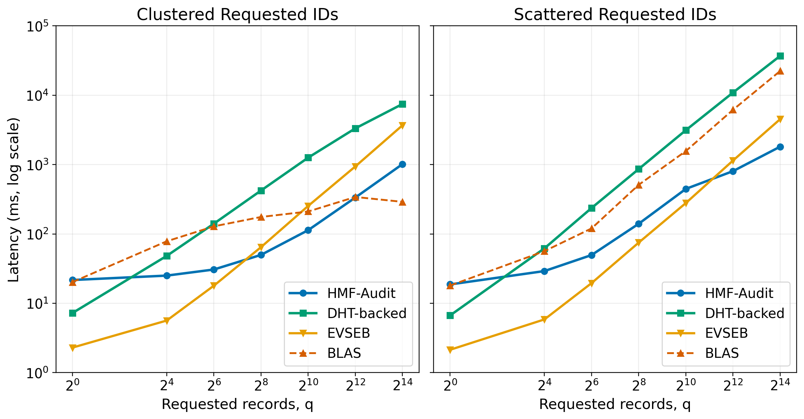
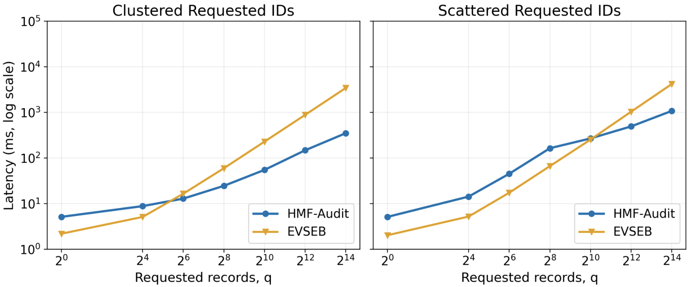
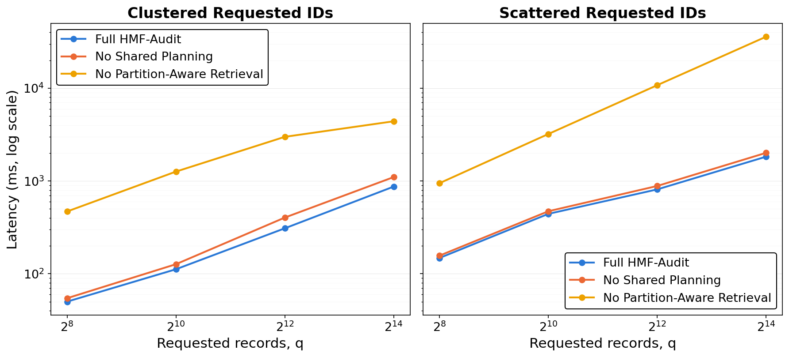

# HMF-Audit

**A tamper-evident audit-log verification service in Go, backed by Cassandra and PostgreSQL.**

HMF-Audit lets an auditor cryptographically prove that stored cloud logs were not altered, and pinpoint exactly which logs were tampered with, without re-reading the whole dataset. It is built around a **Hierarchical Merkle Forest (HMF)** that mirrors how the data is partitioned in storage (Segment → Shard → Region → Global).

> **Purpose:** This is a research prototype built to **benchmark against related published work** (EVSEB, BLAS and a DHT-backed baseline) under a shared, persistence-inclusive protocol: same dataset, same query distribution, real PostgreSQL and Cassandra I/O.

## Tech Stack

Go · REST/HTTP · Apache Cassandra · PostgreSQL (pgx) · Docker Compose · `errgroup` concurrency · SHA-256 Merkle commitments · Go tests and benchmarks

## Highlights

- **Batch Merkle proofs** with shared-path deduplication, so a large audit fetches each authentication node once.
- **Hierarchy-aware proof planner** that groups reads by Cassandra partition and batches them into single `IN` queries.
- **Tamper localization**: on a failed audit, a pruning search identifies the exact leaf or authentication node that differs from the committed state, with a replayable, independently verifiable proof.
- **Authenticated Log Locator**: a Merkle B+ tree with range proofs, so the addresses an auditor queries are themselves verified.
- **Checkpoint finality**: roots are bound to an externally anchored checkpoint; requests are pinned to one checkpoint sequence.
- **Concurrent ingestion**: sharded workers with synchronized updates to the authenticated state and storage.
- **Reproducible latency benchmarks** (P50/P95/P99) across batch sizes, placements and tampered-log counts.

## Architecture


Dashed arrows show the ingestion path; solid arrows show verification and tamper localization.

## Concepts Applied

- **Authenticated data structures:** Merkle trees, Merkle B+ trees, batch and range proofs
- **Distributed storage design:** partition-key-aware data modeling, batched `IN` reads, minimizing round trips
- **Concurrency:** bounded worker pools, sharded ingestion, `errgroup` fan-out
- **Algorithm optimization:** replacing map-heavy code with sorted-slice, level-by-level traversal
- **Fallback design:** cheap fast path with a full-verification fallback that never trusts unverified data
- **Domain-separated hashing** and constant-time root comparison
- **Interface-driven design:** dependency injection, testable service boundaries
- **Benchmark methodology:** deterministic datasets, warm-up, percentile latency, fair cross-system comparison

## Benchmark

**Status: in progress.** Benchmarking against the baseline systems is still under way, so no final results are published yet. The latency harness (`benchmarks/latency`) is already in place. It measures P50/P95/P99 across batch sizes, placements and tampered-log counts.

**Verification latency**



**Localization latency**



**Ablation latency**



## Layout

```text
cmd/audit-service/     service entrypoint
internal/hm            ingestion and shard workers
internal/hmf, all      Merkle forest and authenticated locator
internal/hpp           proof planner, builder, verifier
internal/localization  tamper localization
internal/checkpoint    checkpoint and anchoring
internal/storage       Cassandra and PostgreSQL adapters
internal/transport     HTTP API
benchmarks/latency     latency benchmarks and plotting
```

## AI Usage Disclosure

My workflow is to write the boilerplate and structure by hand, then have an AI assistant continue the implementation under my supervision. I reviewed the design, direction and results.

- **Written by me:** `docker-compose.yml`, `internal/all`, `internal/canonicalize`, `internal/domain`, `internal/hm`, `internal/hmf` and `internal/storage`. I wrote these first to practice my own coding skills.
- **AI-written under my supervision:** everything else, including `internal/hpp`, `internal/localization`, `internal/checkpoint`, `internal/services`, `internal/transport`, `cmd/audit-service` and `benchmarks`.
